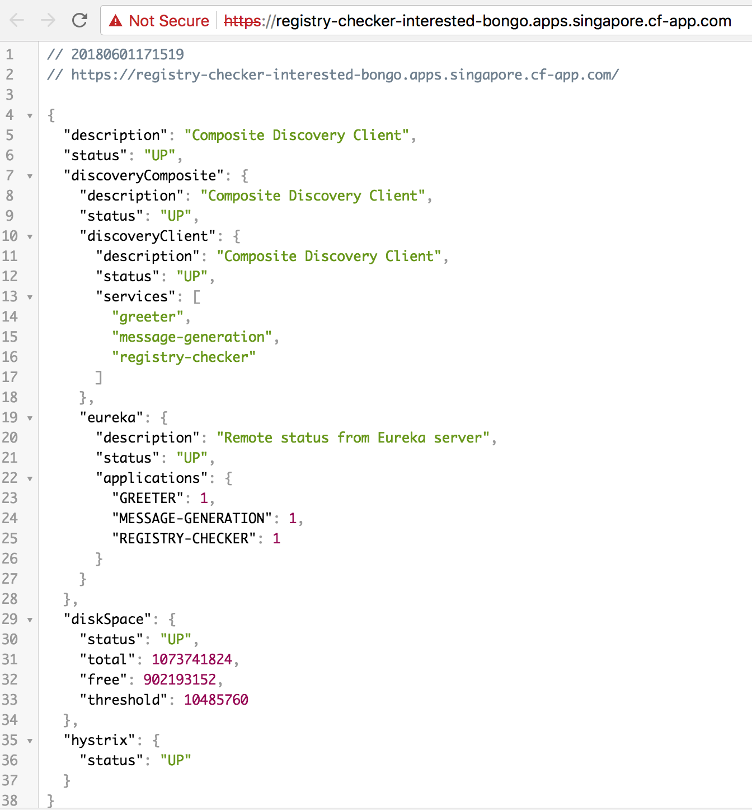

# registry-checker-boot-1x

registry-checker-boot-1x is a example applications demonstrating the use of Spring Cloud Service Registry, the integration of Spring Boot Actuator in Apps Manager and with this to quickly check registry-checker-boot-1x connects to Spring Cloud Service Registry instances for Pivotal Cloud Foundry. (For information on the Service Registry product, please see [the documentation](http://docs.pivotal.io/spring-cloud-services/1-5/common/service-registry/).)

## Building and Deploying

Build the project from the root (```registry-checker-boot-1x```) directory:

```
$ ./mvnw package
```
Create a Service Registry instances


```
cf cs p-service-registry standard service-registry
```

Set the `TRUST_CERTS` environment variable in the [manifest.yml](manifest.yml) to the API endpoint of your Elastic Runtime instance (as in `api.example.com`).

```
applications:
- name: registry-checker
  disk_quota: 1G
  instances: 1
  memory: 1G
  random-route: true
  path: target/registry-checker-boot-1x-0.0.1-SNAPSHOT.jar
  services:
  - service-registry
  env:
    TRUST_CERTS: api.example.com
```

*Setting `TRUST_CERTS` causes Spring Cloud Services to add the the SSL certificate at the specfied API endpoint to the JVM's truststore, so that the client application can communicate with a Service Registry service instance even if your Elastic Runtime instance is using a self-signed SSL certificate (see the [Service Registry documentation](http://docs.pivotal.io/spring-cloud-services/service-registry/writing-client-applications.html#self-signed-ssl-certificate)).*

Push the applications

```
cf push
```

## Trying It Out

Visit the application home page. The home page provides the response from Spring Boot Actuator "actuator/health" endpoint. Here you can see if the app successfully connected to the Service Registry.



Visit Apps Manager and find the Spring Boot Actuator integration. The overview tab provides the response from Spring Boot Actuator "actuator/health" endpoint. Here you can see if the app successfully connected to the Service Registry.


Visit Management Dashboard of the Service Registry instance bound with the app. Here you can see the apps successfully registered with the Service Registry instance.


For more information about the Service Registry and its use in a client application, see the [Service Registry documentation](http://docs.pivotal.io/spring-cloud-services/service-registry/writing-client-applications.html).
